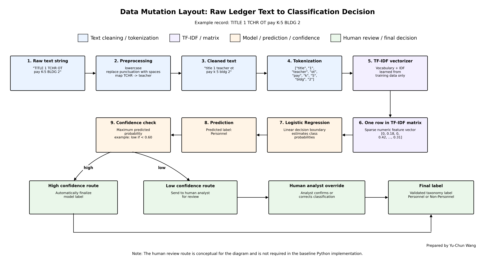

# Baseline Text Classification Pipeline for Financial Ledger Descriptions

This project demonstrates a reproducible Python text classification workflow for labeling noisy financial ledger descriptions as either **Personnel** or **Non-Personnel** expenses.

The goal is to present an end-to-end machine learning workflow, including text preprocessing, abbreviation normalization, train/test validation, TF-IDF vectorization, baseline model training, evaluation, and a conceptual data mutation diagram.

## Project Overview

Financial ledger descriptions are often messy, abbreviated, and inconsistent. This project builds a baseline text classification pipeline that converts raw text descriptions into standardized expense categories.

The workflow includes:

1. Loading financial ledger description data
2. Cleaning and normalizing raw text
3. Mapping common abbreviations to more meaningful terms
4. Splitting the data into training and test sets
5. Converting text into TF-IDF features
6. Training a baseline linear classification model
7. Evaluating model performance using precision, recall, and F1-score
8. Explaining the data transformation lifecycle through a data mutation diagram

## Repository Structure

```text
text-classification-ledger-expenses/
│
├── README.md
├── requirements.txt
├── .gitignore
│
├── data/
│   └── sample_ledger_expenses.csv
│
├── notebooks/
│   └── text_classification_pipeline.ipynb
│
└── outputs/
    ├── data_mutation_layout.png
    └── data_mutation_layout.pdf
```

## Data

The sample data included in this repository are synthetic examples created for demonstration purposes. No proprietary, confidential, or employer-provided dataset is included.

The dataset contains two columns:

* `raw_text`: noisy or abbreviated financial ledger description
* `category`: target label, either `Personnel` or `Non-Personnel`

Example records may include abbreviated descriptions related to teacher salary, office supplies, substitute teacher costs, utility bills, repairs, and other school district operating expenses.

## Methods

The project uses a simple and interpretable machine learning pipeline:

* Text preprocessing
* Abbreviation mapping
* Train/test split
* TF-IDF vectorization
* Baseline linear classifier
* Classification report with precision, recall, and F1-score

The pipeline is intentionally simple and reproducible. The emphasis is on software engineering hygiene, data transformation logic, model validity, and clear communication of the workflow.

## Data Mutation Layout

The diagram below illustrates how a raw ledger description is transformed through the machine learning pipeline, including preprocessing, tokenization, TF-IDF vectorization, model prediction, confidence review, and final categorization.



A PDF version is also available here: [`outputs/data_mutation_layout.pdf`](outputs/data_mutation_layout.pdf)

## Key Skills Demonstrated

This project demonstrates experience with:

* Python
* pandas
* scikit-learn
* Text preprocessing
* TF-IDF feature engineering
* Supervised text classification
* Train/test validation
* Model evaluation
* Data cleaning
* Reproducible notebook development
* Communicating data transformations to technical and non-technical audiences

## How to Run

First, install the required packages:

```bash
pip install -r requirements.txt
```

Then open the notebook:

```bash
jupyter notebook notebooks/text_classification_pipeline.ipynb
```

Run the notebook from top to bottom.

## Outputs

This repository includes supporting output files:

* `outputs/data_mutation_layout.png`
  Image version of the conceptual workflow diagram, displayed directly in this README.

* `outputs/data_mutation_layout.pdf`
  PDF version of the same workflow diagram for easier downloading, sharing, or printing.

These outputs are included to complement the code and help readers quickly understand the end-to-end data transformation and modeling workflow.

## Code Sample Highlights

Recommended files to review:

1. `notebooks/text_classification_pipeline.ipynb`
   End-to-end text classification workflow, including preprocessing, model training, and evaluation.

2. `data/sample_ledger_expenses.csv`
   Synthetic example data used for demonstration purposes.

3. `outputs/data_mutation_layout.png`
   Conceptual diagram showing how raw text is transformed through preprocessing, tokenization, vectorization, model prediction, and human review logic.

4. `outputs/data_mutation_layout.pdf`
   PDF version of the data mutation diagram.

## Notes on Data Leakage Prevention

The train/test split is performed before model fitting. The TF-IDF vectorizer is fit only on the training data and then applied to the test data through a scikit-learn pipeline. This helps prevent information from the test set from leaking into the model training process.

## Notes

This repository is intended as a portfolio-style project to demonstrate practical skills in text classification, data preprocessing, and reproducible machine learning workflow development.

The dataset is synthetic and included only for demonstration. The project focuses on workflow clarity, baseline modeling, and transparent communication of the transformation process.

## Author

**Yu-Chun Wang**,
Ph.D. Candidate in Statistics,
George Mason University
